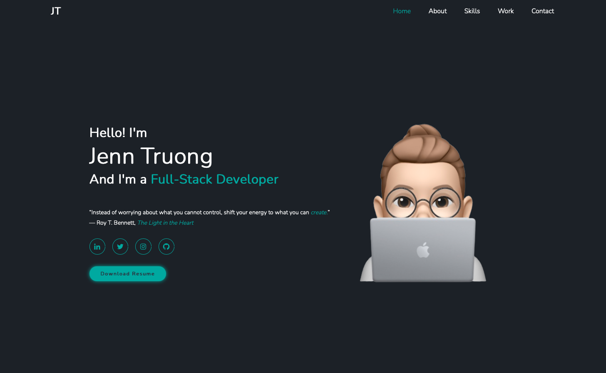

# Jen Truong Portfolio

 

## Project Description
This portfolio was created for the purposes of getting to know me as a developer and showcase what I have created. Through this project, I hope you will get to see my personality and what my creativity instills. Follow along for my journey through coding!

 

## Table of Contents
- [Deployment](#installation)
- [Usage](#usage)
- [Credits](#credits)
- [License](#license)
- [Questions](#questions)

 

## Deployment
  

[Repository](https://github.com/jentruong09/jenTruongPortfolio)

 

[Live Deployment](https://jentruong09.github.io/jenTruongPortfolio/)

 

## Usage

 

## Credits

Technologies Used in this project:
[Boxicons](https://boxicons.com)

[Image Color Picker](https://imagecolorpicker.com/en)

[Scroll Reveal](https://scrollrevealjs.org)

[Google Fonts](https://fonts.google.com/)

[Bitmoji](https://www.bitmoji.com)

[Memoji](https://support.apple.com/en-us/HT208986)

 

Code Credit:
[Codehal - Build a Complete Responsive Personal Portfolio Website using HTML CSS Javascript](https://www.youtube.com/watch?v=Tkp3FDgOueM)

 

## License 

  
This application uses the MIT License

Copyright 2022 Jennifer Truong

Permission is hereby granted, free of charge, to any person obtaining a copy of this software and associated documentation files (the "Software"), to deal in the Software without restriction, including without limitation the rights to use, copy, modify, merge, publish, distribute, sublicense, and/or sell copies of the Software, and to permit persons to whom the Software is furnished to do so, subject to the following conditions:

The above copyright notice and this permission notice shall be included in all copies or substantial portions of the Software.

THE SOFTWARE IS PROVIDED "AS IS", WITHOUT WARRANTY OF ANY KIND, EXPRESS OR IMPLIED, INCLUDING BUT NOT LIMITED TO THE WARRANTIES OF MERCHANTABILITY, FITNESS FOR A PARTICULAR PURPOSE AND NONINFRINGEMENT. IN NO EVENT SHALL THE AUTHORS OR COPYRIGHT HOLDERS BE LIABLE FOR ANY CLAIM, DAMAGES OR OTHER LIABILITY, WHETHER IN AN ACTION OF CONTRACT, TORT OR OTHERWISE, ARISING FROM, OUT OF OR IN CONNECTION WITH THE SOFTWARE OR THE USE OR OTHER DEALINGS IN THE SOFTWARE.

For more information, please visit: https://opensource.org/licenses/MIT

 

## Questions
If you have any questions, please reach out to a contributor via GitHub:

[Jennifer Truong](https://github.com/jentruong09)
